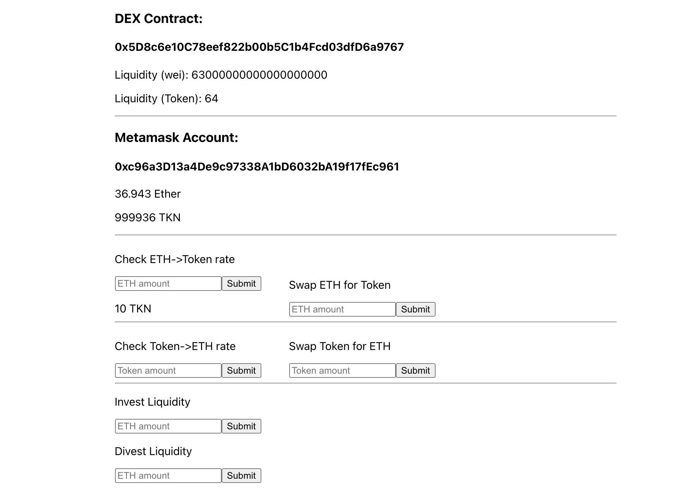

# AMM DEX



This is an automated market-making (AMM) decentralized exchange (DEX) modeled after Uniswap

The main characteristic of this type of exchange is the simple pricing function between both sides of the market to allow for constant liquidity
This pricing scheme, while elegant, has the issue of being subject to extreme slippage under low liquidity and "Impermanent Loss". Future work could possibly address IL

The exchange allows account holders to swap ETH<->Token, and also to provide liquidity to the Dex using ETH & Tokens from their wallet 

The Dex allows any account to exchange ETH with Token (ERC20 contract created for this demo) and Token with ETH
The Dex allows any account to deposit from their wallet an amount of ETH and Token to provide liquidity to the exchange
The Dex allows any account to withdraw an amount of their ETH and Token liquidity back to their wallet

## Prerequisites

- [Node.js](https://nodejs.org)
- [NPM](https://npm.org)
- [MetaMask](https://metamask.io/)
- [Truffle suite - Truffle, Ganache, Drizzle](https://trufflesuite.com/)

## Building & Running

1. Go to the project directory and then:

```bash
npm install
```

Copy the wallet seed from ganache (for use with Metamask)

2. Compile contracts

```bash
truffle compile --all
```

3. Start a private Ethereum network with Ganache on `127.0.0.1:8545`:

Run with GUI app, or with CLI:

```bash
ganache-cli
```

...make sure you can see the 10 accounts with 100 ETH each, can see the deployed 'Dex', 'Token' and 'Migrations' contracts

4. Migrate contracts to the local blockchain

truffle migrate --reset --network develop

5. In your browser login to Metamask to Localhost 8545 and import accounts (using the mnemonic phrase from Ganache)

4. Start the local server 

```bash
cd app
npm run start
```

5. Navigate to `localhost:3000` in your browser

## Testing

Running the Truffle tests:

```bash
truffle test
```